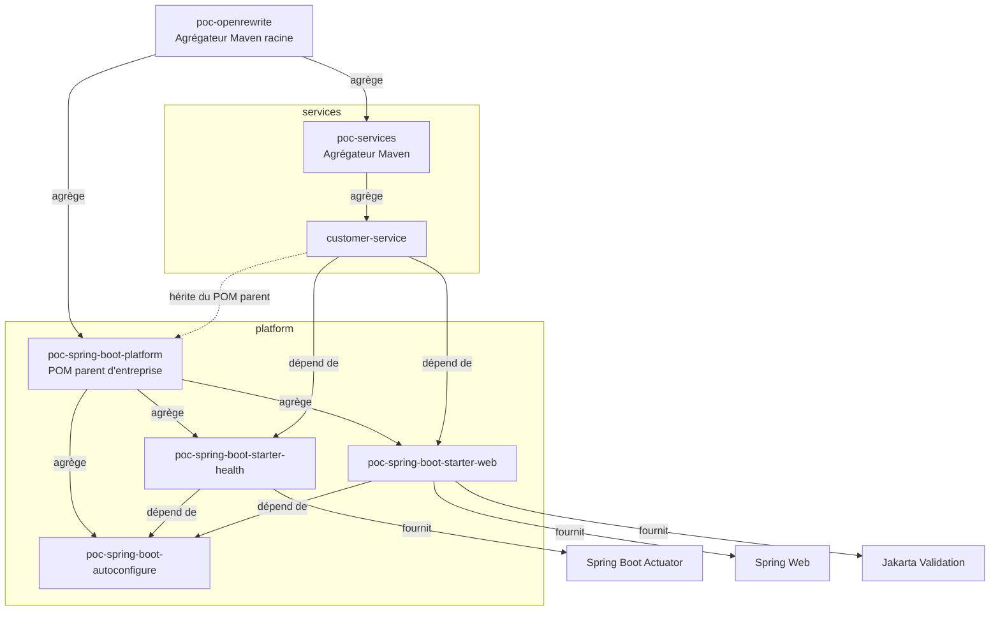
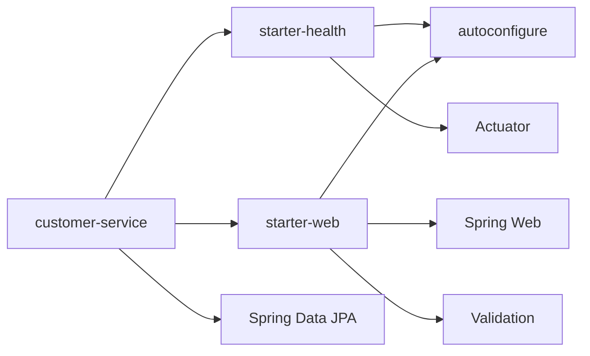

# Architecture du POC

## Vue d'ensemble

Le repository est un projet Maven multi-module. Il contient un agrégateur racine, une plateforme Spring Boot partagée et un ensemble de services réduit actuellement à `customer-service`.

Les flèches d'agrégation décrivent le reactor Maven. Les flèches de dépendance et d'héritage décrivent le modèle effectivement consommé par le service ; ce sont des relations distinctes.

## Maven aggregator racine

Le projet `com.example.poc:poc-openrewrite:1.0.0-SNAPSHOT`, de packaging `pom`, agrège les répertoires `platform` et `services`. Il orchestre leur ordre de construction dans un reactor Maven unique.

Cet agrégateur n'est pas le parent Maven consommé par les applications. `customer-service` hérite directement de `poc-spring-boot-platform`. Le POM racine porte également `org.openrewrite.maven:rewrite-maven-plugin` en version 6.45.1, sans recipe active ni exécution attachée au cycle de vie Maven.

Le repository fournit le Maven Wrapper 3.3.4 en mode `only-script`, configuré pour télécharger Maven 3.9.16.

## `poc-spring-boot-platform`

`com.example.poc:poc-spring-boot-platform:1.0.0` représente le POM parent d'entreprise. Il est à la fois parent des composants de plateforme et de `customer-service`, et agrégateur des trois modules internes de la plateforme.

Il centralise :

- Java 17 dans la propriété `java.version` ;
- Spring Boot 3.5.16 dans la propriété `spring-boot.version` ;
- les encodages de build et de reporting en UTF-8 ;
- le `dependencyManagement` par import du BOM `spring-boot-dependencies` ;
- le `pluginManagement` commun.

Son `pluginManagement` fixe les éléments suivants :

- `maven-compiler-plugin` 3.15.0 avec `release` positionné sur Java 17 ;
- `maven-surefire-plugin` 3.5.2 pour l'exécution des tests ;
- `spring-boot-maven-plugin` 3.5.16, via la propriété de version Spring Boot.

Le BOM gère les versions des dépendances Spring Boot et des bibliothèques couvertes par celui-ci. Les modules consommateurs ne redéclarent donc pas les versions de leurs starters Spring Boot.

## `poc-spring-boot-autoconfigure`

Ce module JAR porte l'auto-configuration interne minimale de la plateforme :

- `PocPlatformAutoConfiguration` est annotée avec `@AutoConfiguration` ;
- son nom qualifié est déclaré dans `META-INF/spring/org.springframework.boot.autoconfigure.AutoConfiguration.imports`, mécanisme utilisé par Spring Boot 3 ;
- elle expose un bean `PlatformInfo` ;
- `PlatformInfo` est un record contenant `name` et `version` ;
- les valeurs exposées sont `POC Spring Boot Platform` et `1.0.0`.

Le test `PocPlatformAutoConfigurationTest` charge explicitement l'auto-configuration avec `ApplicationContextRunner`. Il vérifie qu'un unique bean `PlatformInfo` existe et contrôle ses deux valeurs avec AssertJ.

Le module dépend de `spring-boot-autoconfigure`. Il déclare aussi `spring-boot-configuration-processor` comme dépendance optionnelle. Ses dépendances de test sont `spring-boot-test`, JUnit Jupiter et AssertJ.

## `poc-spring-boot-starter-health`

Ce starter ne contient aucune classe Java. Il assemble :

- `poc-spring-boot-autoconfigure:1.0.0`, qui rend `PlatformInfo` disponible ;
- `spring-boot-starter-actuator`, qui apporte les capacités d'observabilité et notamment l'endpoint de santé.

Il représente un starter interne orienté exploitation et état de santé.

## `poc-spring-boot-starter-web`

Ce starter ne contient aucune classe Java. Il assemble :

- `poc-spring-boot-autoconfigure:1.0.0` ;
- `spring-boot-starter-web` pour le socle Spring MVC et HTTP ;
- `spring-boot-starter-validation` pour Jakarta Validation.

Il représente le point d'entrée commun des services web de l'organisation.

## `customer-service`

`com.example.poc:customer-service:1.0.0-SNAPSHOT` est un service Spring Boot réaliste mais volontairement simple. Il hérite directement de `poc-spring-boot-platform:1.0.0` avec un `relativePath` vers le POM local de la plateforme.

Le service consomme les starters internes `health` et `web`. Il ajoute Spring Data JPA, H2 au runtime et `spring-boot-starter-test` pour les tests. Le `spring-boot-maven-plugin` est déclaré sans version locale : sa version provient du `pluginManagement` de la plateforme.

Le code contient :

- une application `CustomerServiceApplication` ;
- une entité JPA `Customer` avec identifiant auto-généré ;
- un `CustomerRepository` fondé sur `JpaRepository` ;
- un `CustomerService` pour la création, la lecture et la conversion vers les DTO ;
- un `CustomerController` exposant `POST /api/customers` et `GET /api/customers` ;
- les records `CreateCustomerRequest` et `CustomerResponse` ;
- des contraintes `@NotBlank` et `@Email` sur la requête de création ;
- une base H2 en mémoire, avec génération du schéma par Hibernate et Open Session in View désactivé.

Les tests présents couvrent le service avec Mockito, le contrôleur avec `@WebMvcTest` et MockMvc, la validation d'une requête incorrecte, le chargement du contexte complet et la présence du bean `PlatformInfo`.

## Flux de dépendances

L'auto-configuration est transitive par les deux starters. Maven ne conserve qu'une version du même artefact dans le graphe de dépendances du service.

## Pourquoi cette architecture est représentative

Une plateforme Spring Boot d'entreprise sépare généralement la gouvernance technique de la logique applicative. Le POM parent impose les versions et règles de build ; les starters expriment des capacités cohérentes et réutilisables ; les auto-configurations installent automatiquement les composants partagés ; les services se concentrent sur leur domaine.

Le POC reproduit ces responsabilités et leurs relations sans introduire la complexité d'une plateforme de production. Une migration de Java ou de Spring Boot doit donc traverser les mêmes niveaux structurants : parent Maven, auto-configuration, starters, puis applications consommatrices. Cette organisation permet d'évaluer à la fois la migration du socle et la propagation contrôlée vers plusieurs services futurs.

## Navigation

- [Présentation du POC](README.md)
- [Plan de tests](plan-tests.md)
- [Stratégie de migration OpenRewrite](migration-openrewrite.md)

